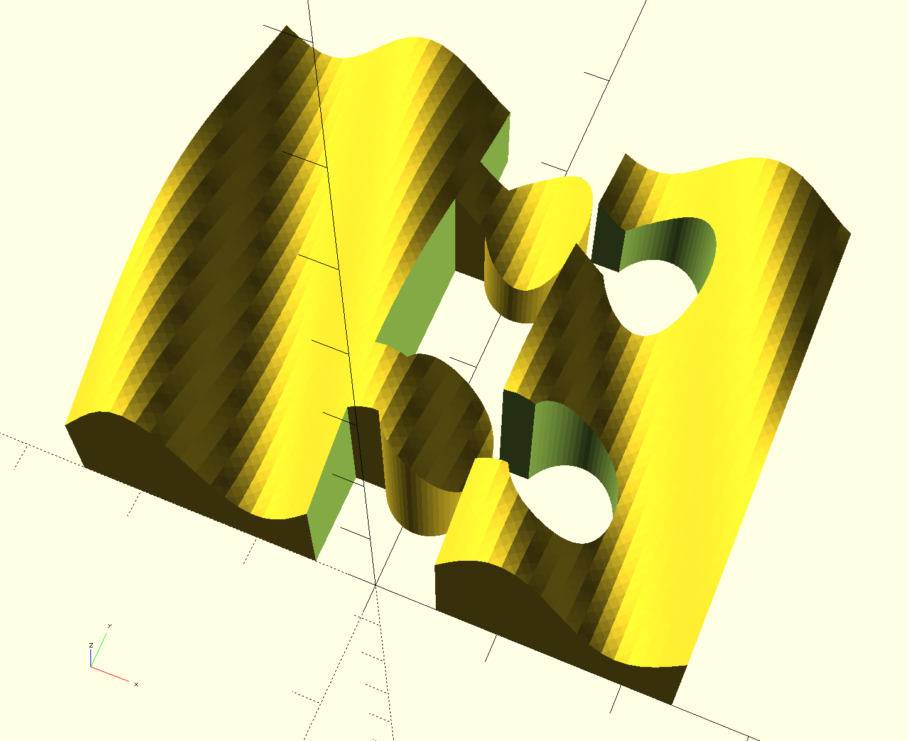

# The problem

You have a beautiful 3D part that you would like to print.
It is too big for your printer. What now?

# The solution

Cut the part into several pieces, and print them separately!

But how?

But even once you did that and have printed the pieces seperately,
how do you put them back together into that beautiful part? How do
you align the pieces properly? And wouldn't it be better if the
pieces were holding together with more than just glue, too?

Let's cut in a more ragged line! A Zigzag line would be great for
alignment. Or maybe a cut in the shape of puzzle pieces, so we
might not need any glue at all!

Sounds complicated? It could be. But here is a bit of
[OpenSCAD](http://www.openscad.org) code that makes it simple: This is what it does:

# Features

* A collection of pre-defined OpenSCAD "modules" that can take any
  3D part defined in (or imported into) OpenSCAD, and cut it into two
  parts that can be printed separately.
* Different cuts are available;
  * The Comb cuts rectangular notches into one of the pieces, and extends
    matching rectangular fingers on the other.
  * The ZigZag makes a zig-zag line from equilateral triangles.
  * The Puzzle makes, you guessed it, the typical puzzle piece form where
    the two pieces can be snapped together.
* All settings have defaults, and you can override them, to define things
  such as:
  * the size of the box, triangle etc elements (height, width, etc)
  * the number and location of them, so you can pick the best place for them
    given the particularities of your beautiful 3D part.
  * the fit is configurable as well
* In the simplest case (if you use the defaults), you just need to add 3 lines
  of code to your model:
  * At the beginning of the file, add a `use ...` statement to import the 
    module defining the code you want to use.
  * The declaration of the cut, in front of your model, such as:
    `Comb() {`
  * Then ending `}` right after.

Here's the best part:
* You can define and use your own shape of cut, and it's almost as simple.
  All you need to do is define the shape of cut as an OpenSCAD 2D shape,
  and pass it into a model called `LeftRight`. This is how all the cuts
  we have predefined work.
* Don't like our puzzle shape? Want something goofier? Define it as a 2D
  shape, and pass it it. The library will do the cutting for you.

# How to get started

* Check out this git repo.
* In OpenSCAD, open up file `examples/box-example.scad`. This cuts a simple
  box into two parts.
* Then, open the same file in a text editor. There is a bunch of commented-out
  code. Uncomment one at a time, to see different kinds of cuts.
* File `examples/surface-example.scad` cuts a more complicated part whose
  surface is generated from a data file (that is generated with a piece of
  associated python code -- you can ignore that). The image on this page 
  shows this example.
  

# How to define your own cut:

Just look into `comb.scad` for an example. All you need to do is to
define your cut as a 2-D object (we will extrude it suitably for you)
and pass it in with your part into the `LeftRight` module as the
second part.

# Credits

* Thingiverse user [Rich Olson](https://www.thingiverse.com/nothinglabs/about)
  created a PuzzlaCut OpenSCAD library
  [here](https://www.thingiverse.com/thing:35834) on Thingiverse, which inspired
  how to do some of this more simply than I could think of myself.
* OpenSCAD forum user [Jordan Brown](http://forum.openscad.org/template/NamlServlet.jtp?macro=user_nodes&user=1912)
  [helped](http://forum.openscad.org/Operator-problem-tp25984p25991.html) in the
  OpenSCAD forum getting around some non-obviousness in the way OpenSCAD `children()`
  does (or perhaps does not) work.
